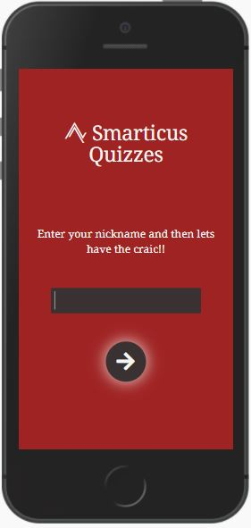
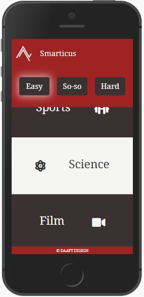
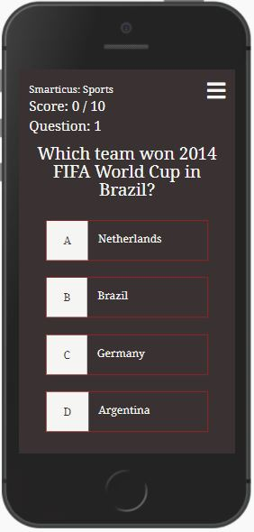
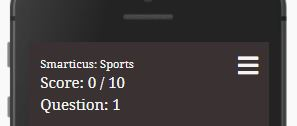

# Smarticus

\
 

\
 

# Goal for this Project
"I AM SMARTICUS!"

Smarticus is an online quiz that allows the user to select from several categories and prove that they are indeed a 'Smarticus' or just a big thumbs down. 

\
 

\
 

# Table of Contents
* [UX](#ux "UX")
    * [User Goals](#user-goals "User Goals")
    * [User Stories](#user-stories "User Stories")
    * [Site Owners Goals](#site-owners-goals)
    * [User Requirements and Expectations](#user-requirements-and-expectations)
         * [Requirements](#requirements)
         * [Expectations](#expectations)
     * [Design Choices](#design-choices)
        * [Fonts](#fonts)
        * [Icons](#icons)
        * [Colours](#colours)
        * [Structure](#structure)
    * [Wireframes](#wireframes)
    * [Features](#features)
        * [Existing Features](#existing-features)
        * [Features to be implemented](#features-to-be-implemented)
    * [Technologies used](#technologies-used)
        * [Languages](#languages)
        * [Tools and Libraries](#tools-and-libraries)
    * [Testing](#testing)
        * [Layout](#layout)
        * [JavaScript](#javascript)
        * [Unfixed Bugs](#unfixed-bugs)
    * [Deployment](#deployment)
    * [Credits](#credits)
# UX

## User Goals
* Visually appealing, not cluttered with information or images.
* Easily navigate through.
* Medium standard of difficulty for the questions.
* Rating on performance.

## User Stories
* As a user, I want to have the site personalised to my username.
* As a user, I want to have clear options for the categories to choose from.
* As a user, I want to see my score progress during a quiz category.
* As a user, I want to see my rating based on my score after completing a category. 
* As a user, I want to exit out of a set of category questions and back to the main selection page.


## Site owners Goals
* Create an easily navigated site using a single page format.
* Create a visually appealing site through the choice of colours and layout.
* Give feedback to the user on performance.
* Have a touch of humour to make the user experience more fun.
* Ensure that a username must be entered to proceed.

### Requirements
* Responsive design, based on mobile-first.
* Use single-page layout.
* Give a positive user experience through colours and layout.
* Give feedback based on performance.

### Expectations
* I expect to know that this is my game based on my username.
* I expect that all the category choices lead to the correct questions.
* I expect to be able to exit out of a category back to my personalised landing page.
* I expect feedback on performance.
* I expect screen size not to affect the quality of my experience.

\
 
[Back to Top](#table-of-contents)
\
 

## Design Choices

### Fonts

I have used [Google Fonts](https://fonts.google.com/ "Google Fonts") to aid me in selecting a suitable font. To keep the font for this game to a clean and simple look, I have chosen [Noto Serif](https://fonts.google.com/specimen/Noto+Serif?query=noto&preview.text=Smarticus&preview.text_type=custom#standard-styles). This is the only one that I will use as I don't feel there is enough content involved to warrant complicating the look with different fonts for headers and text.

### Icons

I will use some icons to enhance the user experience for the choice of categories, they will not be stand-alone but there to accompany the text and break up the look of all text. The icons will be sourced from the [Font Awesome library](https://fontawesome.com/ "Font Awesome"). 

### Colours
To create the colour scheme for the quiz, I used [Colourmind](http://colormind.io/). I went the generate new website colours until I found a colour that I liked, locked it in and kept going to get my basic scheme. I decided that as this was not a complex project where lots of different colours were needed, I would only use three. The generated colour scheme can be seen [here](wireframes/colour-pallet-original.jpg). 

When I checked the contrast in [WebAIM](https://webaim.org/resources/contrastchecker/ "WebAIM"). Where the two colours were grey and white, I had an instant pass on the contrast checker, the results are [here](wireframes/contrast-checker-black-on-white.jpg). However, I had some fails on the tests where the background was red and the foreground was white, the result can be seen [here](wireframes/contrast-checker-fail-white-on-red.jpg). After a small adjustment the results passed and are [here](wireframes/contrast-checker-white-on-red.jpg), I created my final pallet.

\
 


\
 
The colours use are explained from left to right:
* #9F2323 (red) This will be the base colour that will be on the header, also for any forms or information, such as the username input and feedback sections. 
* #F5F6F4 (white) This will be used as a background colour on the categories grid, but primarily as a font colour.
* #3A3232 (grey) This will be used mostly as a background colour for the questions card but also as a font colour where the background is white.

\
 

During the building of the quiz, I realised that I required colour to indicate if a correct answer was submitted. I will go into more detail about this in the [testing section](#testing). I again used [Colourmind](http://colormind.io/) and using my existing pallet to gain a complementary green.
\
 
* #51855f (green) This will show when the user has selected a correct answer.
\
 


\
 

### Structure

I will be building my website with a mobile-first approach. Using the Chrome developer tools to give me the iPhone 5/SE (320px), I will use this as the smallest screen size for styling. The screen size breakpoints that I will be using are from [Bootstrap breakpoints](https://getbootstrap.com/docs/5.0/layout/breakpoints/ "Bootstrap").

| Screen Size | Breakpoint |
| ----------- | ---------- |
| x-small     | <576px     |
| small       | => 576px   |
| medium      | => 768px   |
| large       | => 992px   |
| x-large     | => 1200px  |

\
&nbsp;
[Back to Top](#table-of-contents)
\
&nbsp;

# Wireframes

To develop my wireframes, I have used [Balsamiq](https://balsamiq.com/wireframes/). I created the mobile version firstly and then the tablet and desktop versions followed. As it is a requirement that the site is on one static page, I have broken my wireframes down to reflect. 

The wireframes can be viewed below.

[Mobile Wireframe](wireframes/mobile.png)

[Tablet Wireframe](wireframes/tablet.png)

[Desktop Wireframe](wireframes/desktop.png)

\
&nbsp;
[Back to Top](#table-of-contents)
\
&nbsp;

# Features

## Existing Features

### Spin Loader

The spin loader is, regardless of the screen size always located in the middle of the screen. The size is standard and the colours are consistent with the design. The spin loader appears while the DOM content is loading. Usually, it won't be seen at this point but it is there as a fallback if something doesn't load correctly. It also appears when the category is selected by the user for one second for a cleaner user experience while the questions are being fetched from the API.

\
&nbsp;

\
&nbsp;

### Welcome Screen

The welcome screen, as the name suggests, is where the user will be immediately directed to. The content of the screen, regardless of screen size, is positioned in the middle. On smaller screen sizes where there is a pop-up keyboard, the design is responsive to that so all aspects can always be seen.

\
&nbsp;


\
&nbsp;

On loading, to reduce user clicks, the textbox is set to focus, the colour also changes to grey when it is in this state. 

* *active textbox*
\
&nbsp;


When out of focus, the textbox is white. 

* *idle textbox*
\
&nbsp;


One of the site owners goals was to ensure that a user name was entered to personalise the game, this is done with Html validation.
\
&nbsp;

* *textbox validation*
\
&nbsp;

\
&nbsp;

The button, which is consistent with the design of buttons across the game, uses a font-awsome icon to give the user simple instructions of what to do next. There are several indications to the user that it is to be used to progress through the game.

* A box-shadow highlights it.
* A simple animation if the user was to hover over it.
* A curser set to a pointer.

\
&nbsp;

\
&nbsp;

Very importantly, the site owners name is shown on the welcome screen. The font size and logo are larger than the text, however not too overpowering that they take up all the screen.

Under the site owners name is a small amount of text giving simple instruction to the user of the first step to take.

* *Phone*
\
&nbsp;

\
&nbsp;

* *Tablet*
\
&nbsp;

\
&nbsp;

* *Desktop*
\
&nbsp;

\
&nbsp;

\
&nbsp;
[Back to Top](#table-of-contents)
\
&nbsp;

### Quiz Category Screen

This screen has the **Smarticus** logo fixed as a permanent header to the page. This being consistent with the site owner's name being present on every screen so the user doesn't lose contact with the owner. It is large enough to be easily read but not too big as to impede the user's view of the categories. 

The difficulty levels are also placed here, and along with the **Smarticus** logo, they are always in view on this screen so the user doesn't have to scroll back to the top of the page if they decide to change level. When the game is initially loaded, the default difficulty is set to 'Easy'. This is highlighted by the box-shadow effect that is present on the other buttons across the game, when the user changes difficulty, the shadow effect reflects this.

* *Header view on initial load of the categories screen*
\
&nbsp;


\
&nbsp;

* *Header view when scrolled down the categories screen*
\
&nbsp;

\
&nbsp;

The personalisation of the game begins at this point. Whatever the user decided to enter on the welcome screen, is carried forwards to here and is used as part of a quick, to the point welcome message with instructions.

*User name input on welcome screen*
\
&nbsp;

\
&nbsp;

*Welcome message on categories screen*
\
&nbsp;

\
&nbsp;

The categories are clean and clear with their description and are also helped visually with a font-awsome icon. The text and icon alternate from left to right, giving a more comfortable feel to the user's eye as they scan through the screen. The alternating colour scheme is a sharp design that encourages the user to scroll down on smaller devices to see all the categories. On the desktop design, the categories are set to fill the screen height so there is no need for scrolling. They are also set to adjust the position of categories, depending on how the checker pattern changes with the screen size. 

To increase user experience, rather than just the text having to be clicked for the user to progress to the chosen category, the whole colour block it sits in carries out this function. This allows the user not to have to be as precise with their actions.

Also situated at the very bottom of the screen in the form of a footer, is the developers name.  
\
&nbsp;

* *Phone*


\
&nbsp;

* *Tablet*


\
&nbsp;

* *Desktop*


\
&nbsp;

\
&nbsp;
[Back to Top](#table-of-contents)
\
&nbsp;

### Question Screen 

As mentioned earlier, the spin loader screen initially appears every time the user opens up the question screen while the questions are loading, details on this are in the [spin loader](#spin-loader) section of existing features.

This screen is the main game screen. It is sectioned into 3 areas:
* Quiz progress details 
* The question
* The answers


\
&nbsp;

The quiz progress details again can be split up into four parts:
* The category
* The score
* The question
* Close screen icon


\
&nbsp;

The category, in keeping with the rest of the screens, has **Smarticus** included in it to keep the user in touch with the site owner's name. It also then displays the category of the question asked, this is pulled from the API.

The score is then displayed beneath the category. The format is 'correct answers/number of questions asked'. The correct answers increments for each correct answer that is answered by the user and the number of questions is dictated by the developer within the code so stays static on the display itself. 

The close button is located in the top right corner of the screen. This exits out of the current set of quiz questions and returns to the personalised categories screen. It also resets the user's score and the question number.

Finally, the question number displays to the user how many questions have been asked. This increments for every time that the user get presented with a new question.


The question is populated using the API and is set to a larger font than the rest of the screen, for clarity to the user.

The answers are designed to be as simple to look at as possible, but also pack in enough information as needed. There is an option identification, A, B, C and D and these are in contrast colours to the actual answer itself. The curser is also set to a pointer for user experience of larger screen sizes.

If the answer selected is correct, the option selected flashes green before moving to the next question in the category.


\
&nbsp;

If the answer is incorrect, the selected option flashes red and also the correct answer flashes green so the user can learn from their mistake.


\
&nbsp;

\
&nbsp;
[Back to Top](#table-of-contents)
\
&nbsp;

### Results Screen

The results screen has very little content, except the essentials. 
* The site owner's name and logo
* Feedback text
* Final score
* Return button

The site owners name and logo continue with the rest of the screens and is pronounced and clear at the top of the page.

The text feedback uses the username to personalise the final message and also adds in the category that was last attempted. There are nine different messages to the user depending on the results and which difficulty level they  are playing under. Here are an example of some of the screns.

* Less than 5 out of 10


\
&nbsp;

* Greater than or equal to 5 out of 10


\
&nbsp;

* Greater than or equal to 8 out of 10


\
&nbsp;

The final score follows the feedback comment. This is simply just a copy of the score from the question screen and displayed clearly for the user to see.

The return button is the same in design as the welcome screen button to keep consistency across the game. It also includes the animation while the user hovers over it, as seen in the [Welcome Screen](#welcome-screen). This button has a dual purpose, firstly it returns the user to the personalised categories screen and secondly it resets the game ready for another round.

\
&nbsp;

## Features to be Implemented

Because there is such a wide variety of questions in the [Open Trivia Database](https://opentdb.com/api_config.php "Open Trivia Database"), the layout could change and instead of a categories screen, two dropdowns could be shown instead. The user then could select the category and the difficulty that they prefered.

Also, a countdown timer could be included. The only drawback to this would be limited available room on a small device. For example, an iPhone 5/SE leaves little or no room for any extra features to what is already there.

\
&nbsp;
[Back to Top](#table-of-contents)
\
&nbsp;

# Technologies used

## Languages
* [HTML](https://en.wikipedia.org/wiki/HTML "HTML")
* [CSS](https://en.wikipedia.org/wiki/CSS "CSS")
* [JavaScript](https://en.wikipedia.org/wiki/JavaScript)

## Libraries & Framework
* [Google Fonts](https://fonts.google.com/ "Google Fonts")
* [Font Awesome library](https://fontawesome.com/ "Font Awesome")

## Tools
* For construction and deployment [Gitpod](https://www.gitpod.io/ "Gitpod")
* For wireframes [Balsamic](https://balsamiq.com/wireframes/ "Balsamic")
* For HTML validation [W3C HTML Validation Service](https://validator.w3.org/ "W3C HTML")
* For CSS validation [W3C CSS Validation Service](https://jigsaw.w3.org/css-validator/ "W3C CSS")
* For JS syntax validator [Esprima](https://esprima.org/demo/validate.html "Esprima")
* For the loading spinner [loading.io](https://loading.io/ "loading.io")
* For the box shadows [html-css-js.com](https://html-css-js.com/css/generator/box-shadow/ "html-css-js.com")
* For information on favicons [W3C](https://www.w3.org/2005/10/howto-favicon "W3C")
* For general code queries [W3Schools](https://www.w3schools.com/ "W3Schools")
* For quiz code help [James Q Quick](https://www.youtube.com/channel/UC-T8W79DN6PBnzomelvqJYw "James Q Quick")
* For the colour pallet [Colourmind](https://colormind.io/ "colourmind")
* For the loading spinner gif in the readme file [Capture to a Gif](https://chrome.google.com/webstore/detail/capture-to-a-gif/eapecadlmfblmnfnojebefkbginhggeh/related?hl=en "Chrome Web Store")
* For the quiz questions via API [Open Trivia Database](https://opentdb.com/api_config.php "Open Trivia Database")
* For spell checking [Grammarly](https://chrome.google.com/webstore/detail/grammarly-for-chrome/kbfnbcaeplbcioakkpcpgfkobkghlhen/related?hl=en "Grammarly")


\
&nbsp;
[Back to Top](#table-of-contents)
\
&nbsp;

# Testing
## Layout
During the building of the quiz, I changed my design layout slightly from my initial wireframes design. I felt that the inclusion of a footer restricted the user’s ability to quickly and cleanly play the game. Instead of all the option boxes being within the screen height, the user would have had to scroll to see option D. Along with being able to include the __Smarticus__ name on every page so the user doesn't lose contact, I felt that it was a correct design choice to omit the footer.

In relation to responsive design, in my initial planning stages, I thought that a final responsive screen size of min-width 992px would be sufficient, however, the layout did not suit extra-large screens of greater than or equal to 1200px so I added an extra media query to the design, this was a very little extra work for a big gain for larger screen users.

Occasionally, using the API to generate questions, a long answer was generated. This caused the option boxes to have the text spill over and on some occasions lose the text outside of the 100vh that I had wanted to keep to hit the single page format goal. A change of stying of the options container's heights to auto solved this issue, along with the use of display flex and justify-content, space-evenly on their parent. 

As mentioned earlier in the [Colours](#colours) section, I had to add a green to my pallet. This came as a suggestion from people that I used for testing. They felt that they needed to have some sort of feedback when an answer was answered wrong, with the correct answer shown. An alert was recommended or some sort of pop-up screen with the correct answer included in it and the user then clicks through it to the next question. This idea however would have meant that the user would have had to carry out another action by clicking or tapping on a button to progress. I didn't feel that this was slick enough so decided to add a flash of green on the correct answer if the incorrect option was selected. Initially, I had the timer set for 0.8 seconds but this wasn't just enough time to read the correct answer before the next question was loaded. I adjusted this to 1 second and I feel it works great now.

A second suggestion that was fed back to me during testing was a simple thing to overcome, everyone mentioned that they didn't like the autocomplete on the user name input form. They felt that it covered over the screen and took away from the design. I felt that it improved user-friendliness but the argument put back to me was that predictive text does not require many extra clicks, gives the same result but doesn't take from the design. A quick autocomplete set to off on the form within the Html fixed this.

```html

<form class="center-all" id="user-form" autocomplete="off" 

```

The third recommendation was that there should be a question counter added to the game screen. The testing team noted that they would like to know how many questions that they had answered throughout the game. As this information was already being captured as the questionCounter, this was a simple addition to the screen.

The initial score layout I had was not clear either. I had the layout set up as "3 of 10". This was not clear to the user. Instead of a simple glance and instantly see what it referred to, there was some working out to it. The addition of the word 'Score' and a more generic score layout solved this.

\
&nbsp;

\
&nbsp;

An issue I didn't realise that I had until I opened the quiz on Google Chrome following deployment, rather than through the Gitpod terminal, was that the favicon was not showing. Initially, I had learnt that just putting it into the root folder would ensure that it showed up in on the tab, however, it didn't appear, so using [W3C](https://www.w3.org/2005/10/howto-favicon "W3C") as guidance I added it to the head section of the Html and it worked perfectly.

\
&nbsp;
[Back to Top](#table-of-contents)
\
&nbsp;

## JavaScript

With this being my first project using JavaScript, naturally, I encountered some issues that I had to work through.

One of my major headaches was getting the initial array of data from the API out to use. I lost many hours attempting to work this out. Eventually, after a lot of commits when I thought I had it, then deleted when I didn't and some help from my mentor, I worked it out. This was a huge moment for me as JavaScript then started to then make sense. 

When I ran a test on the quiz, I quickly realised that the initial iteration of the question answers into the option boxes always left the correct answer as option D. This led to a very easy way to cheat if the user worked this out. I had carried out some research and came across the [Fisher-Yates shuffle](https://en.wikipedia.org/wiki/Fisher%E2%80%93Yates_shuffle "Fisher-Yates shuffle"), although this was gaining the random number to slot the correct answer into, I felt that there was no need for a more complex, multi-line code to be included as there were only four options. I added a random sort to the function where a new question is generated, and this simple method works well.

The API from [Open Trivia Database](https://opentdb.com/api_config.php "Open Trivia Database") gave me an issue with the animals' questions. For some reason, it would provide an empty array of questions when the user selected the category 'Animals' and the difficulty of 'Easy'. I tested the API for this selection by putting the exact one populated from [Open Trivia Database](https://opentdb.com/api_config.php "Open Trivia Database") into my fetch. Unfortunately, it still did not give any information back, so I changed all the code relating to animals and swapped it for music. 

The biggest bug that I faced in the development of this game, and the issue that took by far the longest amount of time to rectify, was that when the user played round 2, the counters (score and question counter) all incremented by 2. In the third round, they incremented by 3 and so on. This meant that by round 5, the user was only getting 1 question and the game was ending. 

The problem stemmed from my click event listener within my checkAnswer function. It was looping the extra times as it was called, depending on how many times the handleQuestionScreen function was called. After lots of time, I simply took the forEach click eventListener out of a function and then took that out of the handleQuestionScreen function so it just ran the once as it was needed instead of being forced. 

\
&nbsp;

## Unfixed Bugs


\
&nbsp;
[Back to Top](#table-of-contents)
\
&nbsp;

# Deployment

After writing the code then committing and pushing it to GitHub, this project was deployed using GitHub by the following steps.

* Navigate to the repository on GitHub and click 'Settings'.
* Then select 'Pages' on the side navigation.
* Select the 'None' dropdown, and then click 'master'.
* Click on the 'Save' button.
* Now the website is now live on https://sam-timmins.github.io/smarticus-quizzes/
* If any changes are required, they can be done, committed and pushed to GitHub and the changes will be updated.

\
&nbsp;
[Back to Top](#table-of-contents)
\
&nbsp;

# Credits

For code inspiration, help and advice.

* [Simen Daehlin](https://github.com/Eventyret "Simen Daehlin")
* [James Q Quick](https://www.youtube.com/channel/UC-T8W79DN6PBnzomelvqJYw "James Q Quick")

For testing and feedback, my 'testing focus group' (they know who they are!)

\
&nbsp;
[Back to Top](#table-of-contents)
\
&nbsp;